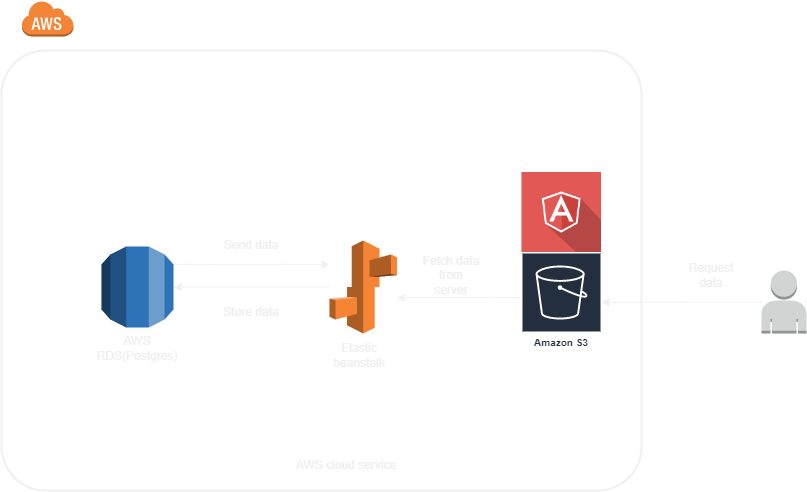

## Udagram Infrastructure

### AWS
#### RDS Postgres
For storing and retrieving data, the application server makes use of the AWS RDS Postgres database.

#### Elastic Beanstalk
The application server is hosted on AWS Elastic Beanstalk. Elastic Beanstalk extracts and executes the application on an endpoint once it has been built, archived, and uploaded to an S3 bucket.`

#### S3 Bucket
AWS S3 Bucket is used to deploy the frontend application. The packaged assets are uploaded to an S3 bucket, which is made publicly accessible.
Bucket S3: `http://trunghlbucket.s3-website-us-east-1.amazonaws.com/`