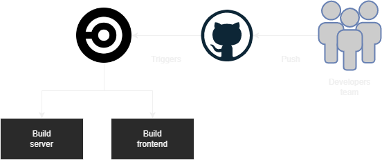

## Udagram Pipeline

### Continuous Integration
#### GitHub
TThe programmers contribute and submit their work to the CircleCI platform's GitHub repository.
When code is posted to GitHub, it activates the CircleCI platform.

#### CircleCI
CircleCI reads the `.circleci/config.yml` file, which instructs the service on what to perform. In the example of Udagram, CircleCI will perform two tasks (frontend and backend configuration).
- **Frontend**: Executes the `build` script from the `package.json` file. Then, using the AWS CLI, upload assets to S3.
- **Backend**: Executes the `build` script, exports all CircleCI configuration environment variables to a `.env` file, and then runs the `deploy` script. The archive is then uploaded to S3 using AWS CLI.